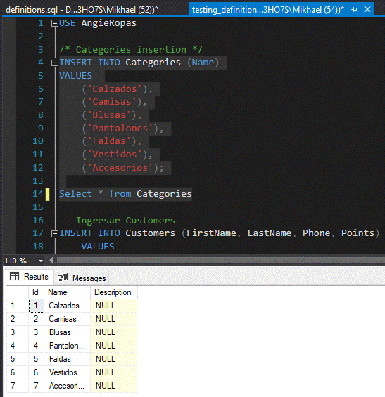

# Ecommerce

Para mostrar su funcionamiento. El código donde se encuentra la definición de las tablas y rutines SQL están en `definitions.sql`, y ejemplos de uso están en `testing_definitions.sql`.

A continuación, capturas de pantalla de algunas partes del código y de las rutinas en ejecución, 

- **0.0 Database definition**:

    
    

- **0.1 Insert categories**:

    
    

- **1) Ingresar nuevos productos:**

    

- **2) Eliminar productos**:

    

- **3) Actualizar productos**:

    

- **4) Registrar compras:**

    
    
    
    

- **5) Mostrar los 5 productos:**

    

- **6) Mostrar los productos más vendidos para un cliente específico:**

    

- **8) Obtener el cliente con más puntos en la tienda para que pueda obtener un descuento:**

    

- **9) Actualizar la información de un cliente**:

    

- **10.0) Registrar 500 ventas**:

    

- **10.1) Ranking de las categorías más vendidas**:

    

- **10.2) Ranking de los productos más vendidos por categoría**:

    

